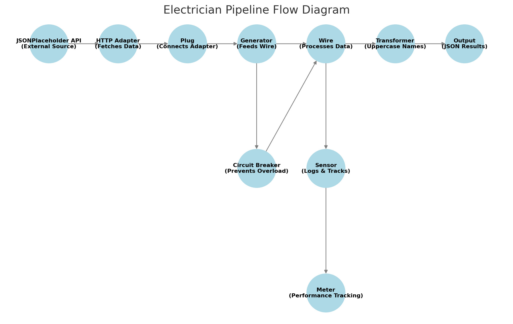

# ⚡ Electrician

**Electrician** is a Go library designed for building highly concurrent, scalable, and secure applications. It brings the power of functional pipelines—akin to Haskell’s _pipes_ and _conduits_—into the Go ecosystem, abstracting away low-level concurrency details so you can focus on data flow, transformations, and reliability patterns.

---

## 🚀 Overview

- **🔢 Generics-first approach** – Ensures end-to-end type safety without `interface{}` conversions.
- **⚙️ Configurable concurrency** – Provides simple, high-level APIs for controlling concurrency, buffering, and parallelism.
- **🛡️ Built-in resilience** – Includes circuit breakers, retry logic (insulators), surge protectors, and backup pipelines.
- **📡 Flexible pipeline architecture** – Uses wires and conduits to construct complex data flows without manual channel management.
- **🌍 Network-ready** – Supports gRPC relays with TLS, enabling secure microservice communication.
- **📊 Real-time instrumentation** – Sensors and meters capture metrics such as throughput, error rates, and resource usage.

Whether you need a simple pipeline for data transformation or a multi-stage microservice architecture with failover and scaling, Electrician provides the tools to build it efficiently.

---

## 🎯 Goals & Philosophy

1. **Simplicity** – Eliminates the need for manually managing goroutines, channels, and synchronization.
2. **Safety** – Uses Go’s generics to enforce type correctness across pipelines.
3. **Performance** – Scales to millions of items with configurable concurrency and optimized processing.
4. **Flexibility** – Provides a modular architecture where components can be customized and extended.

## ⚡ Standard Library First

Electrician is **99% based on the Go standard library**.  
The **only** external dependencies used in `internal/` are:

- **`zap` (Uber’s logging library)** – Used in `internallogger/`, as it’s the **fastest and most structured** logging system in Go.
- **`protobuf` (gRPC and serialization)** – Used in `relay/`, since Electrician supports **cross-service messaging**.

Everything else—including **networking, data transformation, and concurrency management**—is built using **pure Go**, ensuring:

✅ **Maximum compatibility** – No unnecessary dependencies.  
✅ **Minimal attack surface** – Secure and easy to audit.  
✅ **High performance** – Optimized for **low-latency, high-throughput pipelines**.

---

## 🔧 Getting Started

### 1️⃣ Install Electrician:

```bash
go get github.com/joeydtaylor/electrician
```

### 2️⃣ Build Your First Electrician Pipeline (in 5 Minutes)

Let's create a **simple pipeline** that:

1. **Receives input** (in this case, simple strings).
2. **Applies a transformation** (converts text to uppercase).
3. **Outputs the results**.

This example demonstrates **basic pipeline construction** with Electrician’s `Wire` component.

```go
package main

import (
	"context"
	"fmt"
	"strings"
	"time"

	"github.com/joeydtaylor/electrician/pkg/builder"
)

func main() {
	ctx, cancel := context.WithTimeout(context.Background(), 1*time.Second)
	defer cancel()

	fmt.Println("Initializing transformer to convert strings to uppercase...")

	transform := func(input string) (string, error) {
		return strings.ToUpper(input), nil
	}

	fmt.Println("Creating a new Wire with the transformer...")

	wire := builder.NewWire(
		ctx,
		builder.WireWithTransformer(transform),
	)

	fmt.Println("Starting the Wire...")
	wire.Start(ctx)

	fmt.Println("Submitting 'hello' to the Wire...")
	wire.Submit(ctx, "hello")

	fmt.Println("Submitting 'world' to the Wire...")
	wire.Submit(ctx, "world")

	// Wait for the context to be done
	<-ctx.Done()

	fmt.Println("Stopping the Wire...")
	wire.Stop()

	fmt.Println("Loading output as JSON array...")
	output, err := wire.LoadAsJSONArray()
	if err != nil {
		fmt.Printf("Error converting output to JSON: %v\n", err)
		return
	}

	fmt.Println("Output Summary:")
	fmt.Println(string(output))
}
```

### 3️⃣ Explore More Examples

Electrician includes **pre-built examples** demonstrating real-world use cases:

- **Circuit Breakers & Fault Tolerance** – Handle failures with **automatic retries and backup paths**.
- **Secure gRPC Relays with TLS** – Communicate securely between distributed services.
- **Multi-Stage Data Transformations** – Process data through **multiple sequential transformations**.
- **Rate Limiting & Surge Protection** – Prevent overloads and ensure **stable throughput**.

You can find these examples in the `examples/` directory. Run them to see Electrician in action.

### 4️⃣ Per-Package Documentation

Electrician is composed of several **internal packages**, each serving a critical role in **pipeline construction, monitoring, and execution**. Every package contains a **detailed README** explaining its **purpose, configuration, and real-world use cases**.

#### **📂 Internal Packages**

| Package             | Purpose                                                                                 |
| ------------------- | --------------------------------------------------------------------------------------- |
| **adapter/**        | Connects external systems (e.g., HTTP, OAuth2) to Electrician pipelines.                |
| **circuitbreaker/** | Implements **failure detection and recovery mechanisms**.                               |
| **codec/**          | Handles **serialization and deserialization** (JSON, XML, Binary, etc.).                |
| **conduit/**        | Chains multiple Wires together for **multi-stage processing**.                          |
| **forwardrelay/**   | Sends data **outbound** via gRPC to external services.                                  |
| **generator/**      | Produces **autonomous data feeds** (synthetic data, streaming sources).                 |
| **internallogger/** | Structured **logging system** using **Zap** for event tracking.                         |
| **meter/**          | Tracks **performance metrics**, including throughput and error rates.                   |
| **plug/**           | Defines **pluggable data sources**, such as APIs or event streams.                      |
| **receivingrelay/** | Handles **incoming gRPC messages** and integrates them into pipelines.                  |
| **relay/**          | Contains **compiled Protobuf gRPC bindings** for inter-service comms.                   |
| **resister/**       | Implements **priority-based queueing and rate limiting**.                               |
| **sensor/**         | Observability tools for **real-time telemetry and structured logging**.                 |
| **surgeprotector/** | Prevents system overload by **controlling burst data flow**.                            |
| **types/**          | Defines **interfaces and core contracts** for all Electrician components.               |
| **utils/**          | General **helper functions** (file handling, hashing, concurrency tools).               |
| **wire/**           | The **core processing unit** of Electrician, handling **data flow and transformation**. |

Every package follows a (relatively) **consistent structure** with:

- **API methods (`api.go`)** – Defines public interactions with the package.
- **Internal logic (`internal.go`)** – Handles lower-level implementation details.
- **Configuration options (`options.go`)** – Enables **declarative-style setup**.
- **Event notifications (`notify.go`)** – Handles **structured logging and telemetry**.
- **Core Type and Constructor (`package.go`)** – Core Type **Definition and Constructor**.
- **Unit tests (`package_test.go`)** – Ensures correctness and stability.

For a deeper dive, refer to the **package-specific README files** inside `internal/`.

### 5️⃣ The `builder/` Package – User-Friendly API for Electrician

While Electrician’s internal packages provide **low-level components**, the `builder/` package acts as the **public API** that simplifies **pipeline construction**.

Instead of manually assembling Wires, Conduits, and other components, **users interact with `builder/`**, which abstracts away complexity using **functional options and declarative composition**.

---

#### **📂 Structure of the `builder/` Package**

| File                  | Purpose                                                                 |
| --------------------- | ----------------------------------------------------------------------- |
| **adapter.go**        | Provides a streamlined API for connecting external data sources.        |
| **builder.go**        | Core entry point that wires together all Electrician components.        |
| **circuitbreaker.go** | Exposes a **high-level interface** for adding Circuit Breakers.         |
| **codec.go**          | Enables **easy configuration** of serialization formats.                |
| **conduit.go**        | Provides a **declarative API** for building multi-stage processing.     |
| **forwardrelay.go**   | Simplifies **outbound gRPC communication**.                             |
| **generator.go**      | Exposes a clean API for **attaching data producers** to pipelines.      |
| **logger.go**         | Wraps Electrician’s internal **structured logging system (Zap)**.       |
| **meter.go**          | Provides a high-level API for **attaching performance monitors**.       |
| **plug.go**           | Simplifies **dynamic input handling** with pluggable data sources.      |
| **receivingrelay.go** | Exposes methods for **receiving gRPC messages**.                        |
| **resister.go**       | Provides an API for **priority queues and rate-limiting**.              |
| **sensor.go**         | Enables **structured observability** and **real-time telemetry hooks**. |
| **surgeprotector.go** | Makes it easy to **add overload protection mechanisms**.                |
| **utils.go**          | Helper functions that support **convenient pipeline setup**.            |
| **wire.go**           | The main API for **configuring data transformation and flow control**.  |

---

#### **🔧 How `builder/` Works**

- **Declarative Configuration** – Instead of creating objects manually, users **compose pipelines using functional options**.
- **Encapsulation of Best Practices** – Automatically applies **circuit breakers, logging, and concurrency controls**.
- **Zero Boilerplate** – Eliminates the need for manually wiring components together.

---

#### **🚀 Example – Using `builder/` to Create a Pipeline**

With `builder/`, a pipeline that:

### **Complete Step Breakdown**

1️⃣ **Reads data from an API** – The HTTP Adapter fetches user data from `https://jsonplaceholder.typicode.com/users`.  
2️⃣ **Attaches a Sensor** – The Sensor tracks processing metrics and logs events.  
3️⃣ **Sets up a Circuit Breaker** – Prevents failures from overwhelming the system, resetting after 4 seconds.  
4️⃣ **Configures the HTTP Adapter** – Defines request settings, interval, and timeout to manage API calls.  
5️⃣ **Creates a Transformer** – Converts each user’s `name` field to uppercase.  
6️⃣ **Initializes a Plug** – Connects the HTTP Adapter to the pipeline, enabling dynamic data ingestion.  
7️⃣ **Creates a Generator** – Pulls data from the Plug and ensures controlled data flow into the pipeline.  
8️⃣ **Builds a Wire** – The Wire processes the data by integrating the Sensor, Transformer, and Generator.  
9️⃣ **Starts the Pipeline** – The Wire begins processing, fetching, transforming, and outputting data.  
🔟 **Monitors Performance** – The Meter tracks throughput, errors, and real-time processing stats.  
1️⃣1️⃣ **Outputs the Processed Data** – The transformed user data is returned as a structured JSON array.



… can be built in just a few lines of code:

```go
package main

import (
	"context"
	"fmt"
	"strings"
	"time"

	"github.com/joeydtaylor/electrician/pkg/builder"
)

// Define the types corresponding to the JSON structure returned by the API.
type Geo struct {
	Lat string `json:"lat"`
	Lng string `json:"lng"`
}

type Address struct {
	Street  string `json:"street"`
	Suite   string `json:"suite"`
	City    string `json:"city"`
	Zipcode string `json:"zipcode"`
	Geo     Geo    `json:"geo"`
}

type Company struct {
	Name        string `json:"name"`
	CatchPhrase string `json:"catchPhrase"`
	BS          string `json:"bs"`
}

type User struct {
	ID       int     `json:"id"`
	Name     string  `json:"name"`
	Username string  `json:"username"`
	Email    string  `json:"email"`
	Address  Address `json:"address"`
	Phone    string  `json:"phone"`
	Website  string  `json:"website"`
	Company  Company `json:"company"`
}

// For this pipeline, we use a slice of User.
type Users []User

func main() {
	// Create a context with a 30-second timeout.
	ctx, cancel := context.WithTimeout(context.Background(), 30*time.Second)
	defer cancel()

	// Create a Meter to track performance (set an arbitrary total item count).
	meter := builder.NewMeter[Users](ctx, builder.MeterWithTotalItems[Users](7))

	// Create a Sensor that attaches the Meter.
	sensor := builder.NewSensor[Users](builder.SensorWithMeter[Users](meter))

	// Set up a Circuit Breaker that trips after 1 error and resets after 4 seconds.
	circuitBreaker := builder.NewCircuitBreaker[Users](
		ctx,
		1,
		4*time.Second,
		builder.CircuitBreakerWithSensor[Users](sensor),
	)

	// Create an HTTP Adapter to fetch data from JSONPlaceholder.
	httpAdapter := builder.NewHTTPClientAdapter[Users](
		ctx,
		builder.HTTPClientAdapterWithSensor[Users](sensor),
		builder.HTTPClientAdapterWithRequestConfig[Users]("GET", "https://jsonplaceholder.typicode.com/users", nil),
		builder.HTTPClientAdapterWithInterval[Users](4*time.Second),
		builder.HTTPClientAdapterWithTimeout[Users](10*time.Second),
	)

	// Define a transformer that converts each user's name to uppercase.
	transformer := func(users Users) (Users, error) {
		for i := range users {
			users[i].Name = strings.ToUpper(users[i].Name)
		}
		return users, nil
	}

	// Create a Plug that uses the HTTP Adapter and Sensor.
	plug := builder.NewPlug[Users](
		ctx,
		builder.PlugWithAdapter[Users](httpAdapter),
		builder.PlugWithSensor[Users](sensor),
	)

	// Create a Generator that pulls data from the Plug and attaches the Sensor and Circuit Breaker.
	generator := builder.NewGenerator[Users](
		ctx,
		builder.GeneratorWithPlug[Users](plug),
		builder.GeneratorWithSensor[Users](sensor),
		builder.GeneratorWithCircuitBreaker[Users](circuitBreaker),
	)

	// Create a Wire that uses the Sensor, Transformer, and Generator.
	wire := builder.NewWire[Users](
		ctx,
		builder.WireWithSensor[Users](sensor),
		builder.WireWithTransformer[Users](transformer),
		builder.WireWithGenerator[Users](generator),
	)

	// Start the pipeline.
	wire.Start(ctx)

	// Start monitoring performance.
	meter.Monitor()

	// Stop the pipeline.
	wire.Stop()

	// Load the processed output as a JSON array.
	output, err := wire.LoadAsJSONArray()
	if err != nil {
		fmt.Printf("Error converting output to JSON: %v\n", err)
		return
	}

	fmt.Println("Output Summary:")
	fmt.Println(string(output))
}

```
---

## 📖 Further Reading
- **[Per-Package README](./pkg/internal/)** – Each internal sub-package (`wire`, `circuitbreaker`, etc.) contains additional details.
- **[Examples Directory](./example/)** – Demonstrates these internal components in real-world use cases.

---

## 📝 License

All internal packages fall under Electrician’s [Apache 2.0 License](./LICENSE).  
You are free to use, modify, and distribute them under these terms, but note that **they are not designed for direct external use**.

---

## ⚡ Happy wiring! 🚀

If you have any questions or need clarification, feel free to **open a GitHub issue**.
